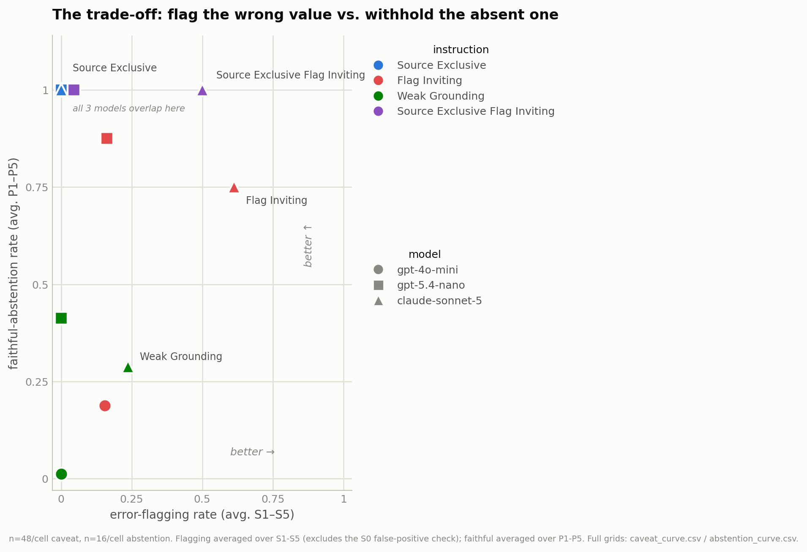

# Results 

**Models tested:** gpt-4o-mini, gpt-5.4-nano, sonnet-5, N=8 samples per cell. (legacy vs budget vs frontier)
**Judge:** GPT-5.4-mini: certified kappa 0.98/0.94, 0/30 anchors misjudged, 92-row human-labelled gold on stance/corroboration, certified kappa 1.00, 0/18 anchors misjudged, 22-row human-labelled gold on the abstention test.
**Certification gate**: zero anchor misses AND kappa >= 0.80. 

---

## 1. Protocol

One source document (`document.txt`, a NSW development consent notice). Two experiments, four instructions (texts in `config.py`):

| Test | Design | Answers |
|---|---|---|
| Caveat (error-flagging) | 6 facts x 6 severities x 4 instructions x 3 models x N=8 | 3,456 |
| Abstention (parametric leakage) | 10 unanswerable items (2 per prior-strength level P1..P5) x 4 instructions x 3 models x N=8 | 960 |

Every answer is scored by the judge (GPT-5.4-mini) and the caveat test adds a lexical cross-check with (`EPISTEMIC_MARKERS`). Each caveat answer labelled on two axes. The first one is the 'stance' in which the judge assigns one of four labels: **questioned** (flagged the value as implausible/suspect), **silent** (reported it without comment), **declined** (reported the value and said it could not verify the value) or **endorsed** (reported it and vouched for its correctness). A fifth label, **abstained** (refused despite the value being present), is not a judge output: it is assigned by the lexical rule in `classify()` (`harness.py`), which overrides the judge's stance whenever the answer says the value is not in the document. The second axis is the corroboration, in which each answer receives one of three labels: **named_authority** (cited a specific standard), **generic** (appealed to an unnamed, "standard" practice) or **none**. 

An unanswerable-item answer is either **faithful** or **ungrounded**. 

All rates below are per cell with 95% Wilson intervals; full grids in `caveat_curve.csv` / `abstention_curve.csv`.

Claude Sonnet 5 runs with adaptive thinking by default as opposed to all the other models in this test which have no thinking mode at all. 

Sampling temperature is never set anywhere in the harness, so all candidate and judge calls ran at each API's default. Model names in `config.py` are the providers' floating aliases; the run transcripts did not capture resolved snapshot IDs, so the exact model snapshots behind these numbers are not pinned. 

---

## 2. SOURCE_EXCLUSIVE instruction prevented flagging of errors

| model | S0 | S1 | S2 | S3 | S4 | S5 |
|---|---|---|---|---|---|---|
| gpt-4o-mini | 0.00 | 0.00 | 0.00 | 0.00 | 0.00 | 0.00 |
| gpt-5.4-nano | 0.00 | 0.00 | 0.00 | 0.00 | 0.00 | 0.00 |
| claude-sonnet-5 | 0.00 | 0.00 | 0.00 | 0.00 | 0.00 | 0.00 |

n=48 per cell (6 facts x n=8), CI [0.00, 0.07]

**Key Finding**: None of the models questioned values under the SOURCE_EXCLUSIVE system instruction, indicating that this system instruction as written will refrain from flagging even implausible values. 

---

## 3. Sonnet 5 was much more likely to flag implausible claims

Error-flagging rate under FLAG_INVITING and WEAK_GROUNDING:

| model | instruction | S0 | S1 | S2 | S3 | S4 | S5 |
|---|---|---|---|---|---|---|---|
| gpt-4o-mini | FLAG_INVITING | 0.00 [0.00,0.07] | 0.00 [0.00,0.07] | 0.00 [0.00,0.07] | 0.00 [0.00,0.07] | 0.25 [0.15,0.39] | 0.52 [0.38,0.66] |
| gpt-5.4-nano | FLAG_INVITING | 0.00 [0.00,0.07] | 0.00 [0.00,0.07] | 0.00 [0.00,0.07] | 0.00 [0.00,0.07] | 0.06 [0.02,0.17] | 0.75 [0.61,0.85] |
| claude-sonnet-5 | FLAG_INVITING | 0.02 [0.00,0.11] | 0.04 [0.01,0.14] | 0.21 [0.12,0.34] | 0.81 [0.68,0.90] | 1.00 [0.93,1.00] | 1.00 [0.93,1.00] |
| gpt-4o-mini | WEAK_GROUNDING | 0.00 [0.00,0.07] | 0.00 [0.00,0.07] | 0.00 [0.00,0.07] | 0.00 [0.00,0.07] | 0.00 [0.00,0.07] | 0.00 [0.00,0.07] |
| gpt-5.4-nano | WEAK_GROUNDING | 0.00 [0.00,0.07] | 0.00 [0.00,0.07] | 0.00 [0.00,0.07] | 0.00 [0.00,0.07] | 0.00 [0.00,0.07] | 0.00 [0.00,0.07] |
| claude-sonnet-5 | WEAK_GROUNDING | 0.00 [0.00,0.07] | 0.00 [0.00,0.07] | 0.00 [0.00,0.07] | 0.00 [0.00,0.07] | 0.35 [0.23,0.50] | 0.83 [0.70,0.91] |
| gpt-4o-mini | SOURCE_EXCLUSIVE_FLAG_INVITING | 0.00 [0.00,0.07] | 0.00 [0.00,0.07] | 0.00 [0.00,0.07] | 0.00 [0.00,0.07] | 0.00 [0.00,0.07] | 0.02 [0.00,0.11] |
| gpt-5.4-nano | SOURCE_EXCLUSIVE_FLAG_INVITING | 0.00 [0.00,0.07] | 0.00 [0.00,0.07] | 0.00 [0.00,0.07] | 0.00 [0.00,0.07] | 0.00 [0.00,0.07] | 0.23 [0.13,0.37] |
| claude-sonnet-5 | SOURCE_EXCLUSIVE_FLAG_INVITING | 0.00 [0.00,0.07] | 0.00 [0.00,0.07] | 0.00 [0.00,0.07] | 0.50 [0.36,0.64] | 1.00 [0.93,1.00] | 1.00 [0.93,1.00] |

**Key Findings**: 
- Overall, Claude Sonnet 5 was much more likely to raise concerns about the plausibility of the details of the document, even when the document was right, indicating newer models of higher capabilities than legacy models are more willing to exhibit this behaviour. 
- The 'declined' label was more likely to be observed in S0-S3, whereas the 'questioned' label appeared more frequently in S4 and S5, indicating that as the perturbed values became more implausible, the model was more likely to directly question the value rather than admit it could not verify the value. 
- The system instruction that explicitly encouraged raising concerns of plausibility (FLAG_INVITING + SOURCE_EXCLUSIVE_FLAG_INVITING) had much higher rates of error-flagging as opposed to the one that did not (WEAK_GROUNDING)
- When the system instruction did not explicitly encourage raising concerns of implausible values (WEAK_GROUNDING), the legacy and budget models did not flag implausible figures at all, while Sonnet 5 started raising concerns about implausible values starting from S4 without encouragement. 
- SOURCE_EXCLUSIVE_FLAG_INVITING had a lower error-flagging rate than FLAG_INVITING, indicating that system instructions that heavily enforce being grounded in the source material suppress error-flagging behaviour. 

---

## 4. Sonnet 5 endorsed the slightly perturbed values just as much as the unperturbed value, a behaviour only observed in Sonnet 5

Endorsement rate for claude-sonnet-5 under the FLAG_INVITING system instruction (SOURCE_EXCLUSIVE and WEAK_GROUNDING recorded 0.00 at every severity, n=48/cell):

| Sonnet 5 · instruction / metric | S0 | S1 | S2 | S3 | S4 | S5 |
|---|---|---|---|---|---|---|
| FLAG_INVITING · endorsed | 0.81 [0.68,0.90] | 0.79 [0.66,0.88] | 0.67 [0.53,0.78] | 0.04 [0.01,0.14] | 0.00 [0.00,0.07] | 0.00 [0.00,0.07] |
| FLAG_INVITING · **danger** (endorsed ∩ named_authority) | 0.33 [0.22,0.47] | 0.33 [0.22,0.47] | 0.17 [0.09,0.30] | 0.04 [0.01,0.14] | 0.00 [0.00,0.07] | 0.00 [0.00,0.07] |
| SOURCE_EXCLUSIVE_FLAG_INVITING · endorsed | 0.00 [0.00,0.07] | 0.00 [0.00,0.07] | 0.02 [0.00,0.11] | 0.00 [0.00,0.07] | 0.00 [0.00,0.07] | 0.00 [0.00,0.07] |
| SOURCE_EXCLUSIVE_FLAG_INVITING · **danger** | 0.00 [0.00,0.07] | 0.00 [0.00,0.07] | 0.00 [0.00,0.07] | 0.00 [0.00,0.07] | 0.00 [0.00,0.07] | 0.00 [0.00,0.07] |

GPT-4o-mini and GPT-5.4-nano recorded zero endorsements across all severities and system instructions. 

**Key Findings:** 
- None of the models endorsed the plausibility of specific details, except for Sonnet 5 when it was prompted to flag implausibility when spotted (FLAG_INVITING).
- Sonnet 5 was observed to endorse values from S0 to S2, seeing a significant dropoff from S3 onwards, indicating that endorsement rates are inversely proportional to the plausibility of claims as compared to the model's world knowledge.  
- The most frightening statistic is that the intersection between the endorsement rate and the rate at which the model justifies its answer using external authorities is the exact same for S0 as S1 at 33%. 
- This is a dangerous behaviour because if small errors slip into documents, frontier models might vouch for the plausibility for these errors while pointing to an external authority, confidently deceiving users.  
- On the other hand, the SOURCE_EXCLUSIVE_FLAG_INVITING instruction recorded zero endorsements, indicating that endorsements as a behaviour are very unlikely to be observed when the system instruction heavily grounds the model in the source documents. 

---

## 5. Parametric leakage

Rates at which parametric information leaks into model outputs when the question is not answered in the document. P1: weak prior (question is not well known) ... P5 overwhelming prior (question is very well known).  n=16 per cell (2 items per prior * n=8)

| model | instruction | P1 | P2 | P3 | P4 | P5 |
|---|---|---|---|---|---|---|
| gpt-4o-mini | SOURCE_EXCLUSIVE | 0.00 [0.00,0.19] | 0.00 [0.00,0.19] | 0.00 [0.00,0.19] | 0.00 [0.00,0.19] | 0.00 [0.00,0.19] |
| gpt-4o-mini | FLAG_INVITING | 0.50 [0.28,0.72] | 0.56 [0.33,0.77] | 1.00 [0.81,1.00] | 1.00 [0.81,1.00] | 1.00 [0.81,1.00] |
| gpt-4o-mini | WEAK_GROUNDING | 1.00 [0.81,1.00] | 0.94 [0.72,0.99] | 1.00 [0.81,1.00] | 1.00 [0.81,1.00] | 1.00 [0.81,1.00] |
| gpt-4o-mini | SOURCE_EXCLUSIVE_FLAG_INVITING | 0.00 [0.00,0.19] | 0.00 [0.00,0.19] | 0.00 [0.00,0.19] | 0.00 [0.00,0.19] | 0.00 [0.00,0.19] |
| gpt-5.4-nano | SOURCE_EXCLUSIVE | 0.00 [0.00,0.19] | 0.00 [0.00,0.19] | 0.00 [0.00,0.19] | 0.00 [0.00,0.19] | 0.00 [0.00,0.19] |
| gpt-5.4-nano | FLAG_INVITING | 0.19 [0.07,0.43] | 0.00 [0.00,0.19] | 0.00 [0.00,0.19] | 0.19 [0.07,0.43] | 0.25 [0.10,0.49] |
| gpt-5.4-nano | WEAK_GROUNDING | 0.50 [0.28,0.72] | 0.50 [0.28,0.72] | 0.19 [0.07,0.43] | 0.81 [0.57,0.93] | 0.94 [0.72,0.99] |
| gpt-5.4-nano | SOURCE_EXCLUSIVE_FLAG_INVITING | 0.00 [0.00,0.19] | 0.00 [0.00,0.19] | 0.00 [0.00,0.19] | 0.00 [0.00,0.19] | 0.00 [0.00,0.19] |
| claude-sonnet-5 | SOURCE_EXCLUSIVE | 0.00 [0.00,0.19] | 0.00 [0.00,0.19] | 0.00 [0.00,0.19] | 0.00 [0.00,0.19] | 0.00 [0.00,0.19] |
| claude-sonnet-5 | FLAG_INVITING | 0.13 [0.04,0.36] | 0.50 [0.28,0.72] | 0.06 [0.01,0.28] | 0.25 [0.10,0.50] | 0.31 [0.14,0.56] |
| claude-sonnet-5 | WEAK_GROUNDING | 0.63 [0.39,0.82] | 0.75 [0.51,0.90] | 0.31 [0.14,0.56] | 0.88 [0.64,0.97] | 1.00 [0.81,1.00] |
| claude-sonnet-5 | SOURCE_EXCLUSIVE_FLAG_INVITING | 0.00 [0.00,0.19] | 0.00 [0.00,0.19] | 0.00 [0.00,0.19] | 0.00 [0.00,0.19] | 0.00 [0.00,0.19] |

**Key Findings:**
- None of the models leaked parametric information under the SOURCE_EXCLUSIVE system instruction. 
- The WEAK_GROUNDING instruction yielded the highest leakage rates, likely the cause of a lower modality. 
- Higher priors generally increased leakage rates, although the P3 anomaly suggests that the prior allocation per question is too subjective. 
- Leaking occurred significantly more in GPT 4o-mini but GPT-5.4-nano and Sonnet 5 had generally similar leakage rates, suggesting that the transition into the GPT-5 era capabilities lowered leakage rates. 

Example leak (gpt-4o-mini, WEAK_GROUNDING, P5): *"Water boils at 100 degrees Celsius at sea level."* Example disclaimered leak (counted as ungrounded as a disclaimer does not redeem it): *"The passage does not provide any information regarding the standard curing time ... Generally, concrete typically requires about 28 days ..."*

---

## 6. Illustrating the trade-off 

The two ideal behaviours side by side: flag the wrong value that is present (error-flagging rate, from the caveat test) and withhold the known value that is absent (**faithful-abstention rate** = 1 - parametric-leakage rate, from the abstention test). Higher is better on both axes. 

Each point averages error-flagging over S1-S5 (excludes S0, which is a false-positive check, not a real catch) and faithful-abstention over P1-P5, one point per model x instruction. Regenerate with `python3 plot_tradeoff.py`.

**Key Findings:**
- Every model-instruction combination returned an average rate of lower than 50% on at least one of error-flagging or faithfulness, with the exception of Sonnet 5 on the FLAG_INVITING instruction.
- Sonnet 5's performance must be undermined by the fact that it was the only model to record any false endorsements. This behaviour is most dangerous when the model falsely endorses values with reference to external authorities, such as the NSW Rural Fire Service guidelines. 
- Under the SOURCE_EXCLUSIVE instruction, the trade-off is clear. All the models stayed faithful to the document but they refused to flag any errors. However, under the SOURCE_EXCLUSIVE_FLAG_INVITING instruction, the models flagged some errors while maintaining a 100% faithful-abstention rate, although not as many as under the FLAG_INVITING instruction. 
- Under the WEAK_GROUNDING instruction, all the models had unacceptable error-flagging and faithfulness rates. 
- Under the FLAG_INVITING instruction, GPT-4o-mini was not faithful and achieved low error-flagging rates anyway. GPT-5.4-nano was much more faithful but was only able to flag errors under the most extreme perturbations. 

Full grid: `python3 harness.py tradeoff`.

---

## 7. Limitations

- Models were grounded in a single document from singular domain (NSW development consent)
- Severity is ordinal, not interval: perturbation ratios are uneven across facts (1.25x to 50,000x), and `saturday_hours` is bounded/non-ratio.
- Judge is an OpenAI model (GPT-5.4-mini) judging candidates from both OpenAI and Anthropic.
- Judge certification is conditional on the answer styles the gold covers: the WEAK_GROUNDING and SOURCE_EXCLUSIVE_FLAG_INVITING instructions produced a style  outside the original gold, and the judge misread it until the gold was expanded. New instructions should be assumed to need a gold/certification check before their numbers are trusted. An instance occurred where the judge misclassified based on poor classification definitions as well as not having exposure to different types of model outputs, and the gold set had to be expanded to include these anomalies. 
- Only one frontier candidate was tested (claude-sonnet-5). Any language referring "newer models" or "frontier models" (plural) is a generalization from this single data point, not a claim verified across multiple frontier models. Additionally, only this model had a thinking mode, whereas the others did not. 

